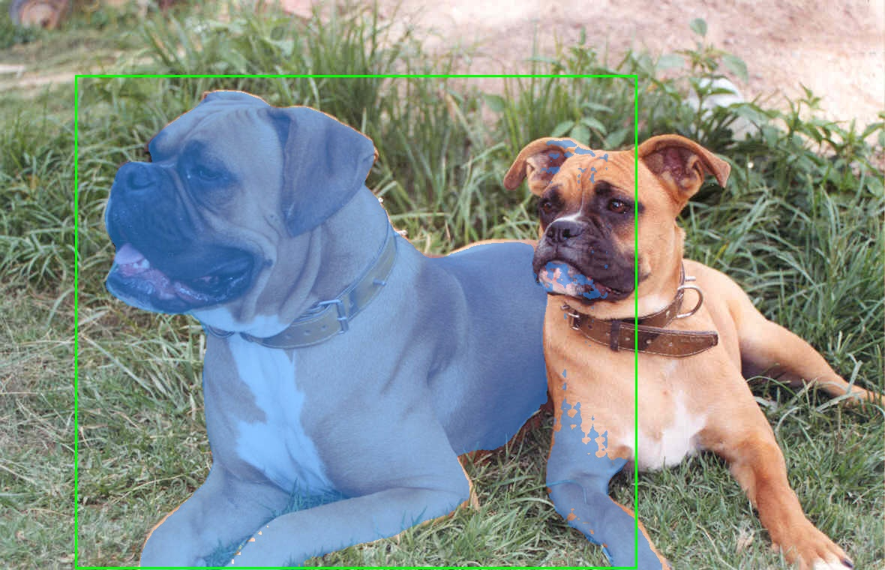
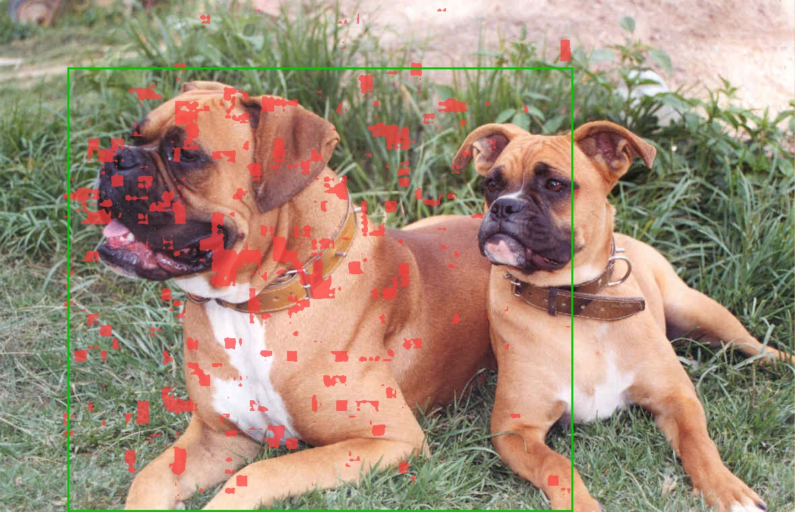
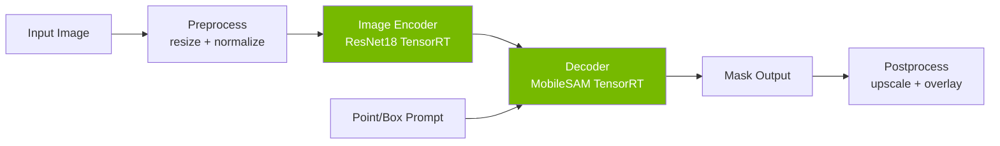
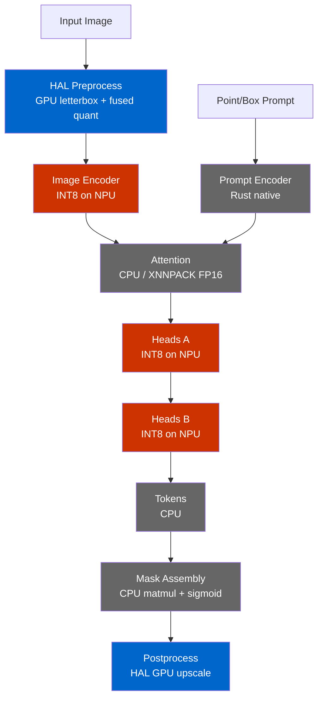
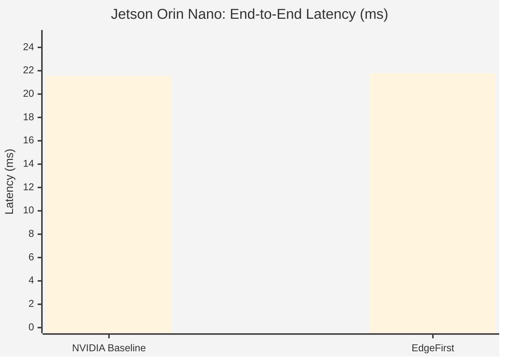
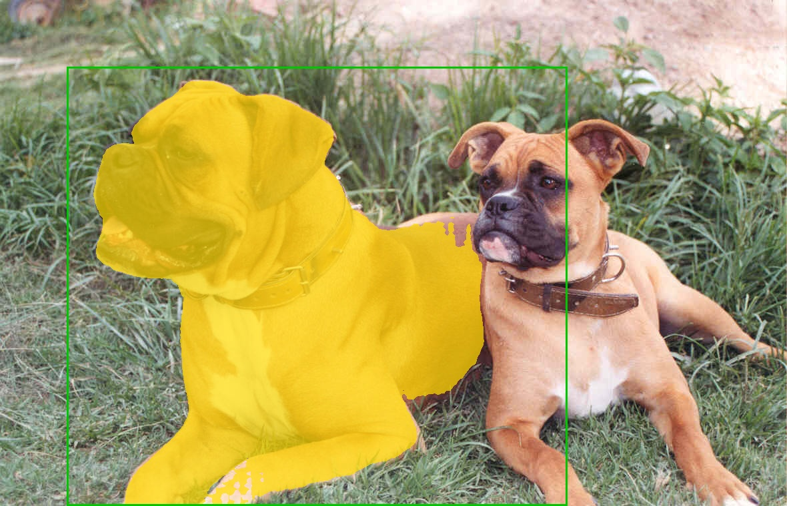
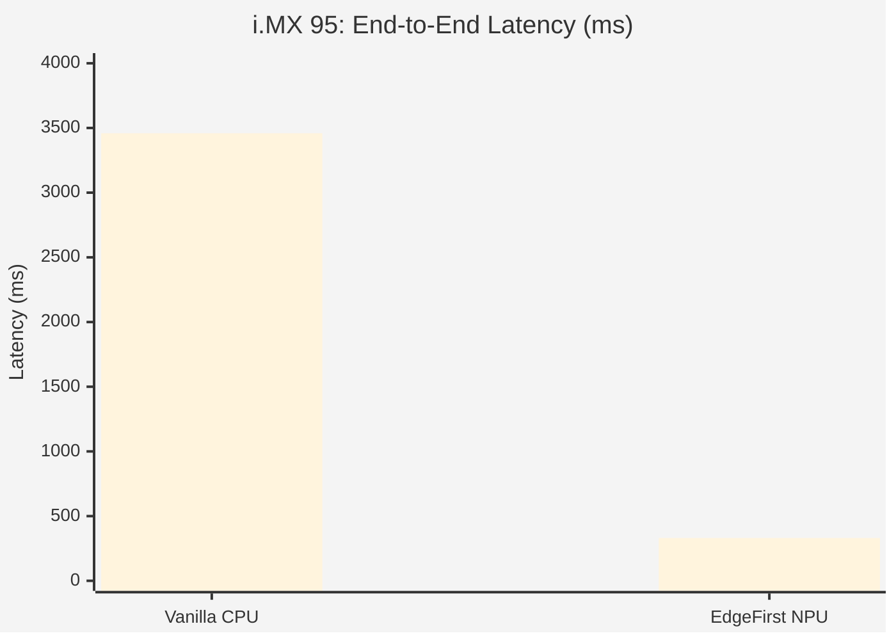

# EdgeFirst NanoSAM: End-to-End Benchmarks

Comprehensive performance comparison of vanilla NVIDIA NanoSAM against
EdgeFirst-optimized NanoSAM on edge platforms.

## Executive Summary

On the NXP i.MX 95, EdgeFirst optimizations deliver a **10.5x speedup**
(3459 ms to 331 ms) while solving the fundamental NPU quantization problem
that prevents vanilla NanoSAM from running on integer-only accelerators.
On Jetson Orin Nano, J1 and J2 use the same ResNet18 architecture and
monolithic TRT decoder, so timings are essentially identical; EdgeFirst
Jetson differentiation will come from future decomposed decoder and HAL
preprocessing work.

| Platform | Config | Total Latency | Speedup |
|----------|--------|--------------|---------|
| Jetson Orin Nano | NVIDIA Baseline | 21.56 ms | 1.0x |
| Jetson Orin Nano | EdgeFirst | 21.77 ms | 1.00x |
| i.MX 95 | Vanilla (CPU) | 3458.79 ms | 1.0x |
| i.MX 95 | Vanilla (NPU) | FAILS | — |
| i.MX 95 | EdgeFirst | 330.7 ms | 10.5x |

### Visual Comparison

#### Jetson Orin Nano

| NVIDIA NanoSAM Baseline | EdgeFirst NanoSAM |
|:---:|:---:|
|  |  |

#### NXP i.MX 95

| Naive NPU Conversion (Broken) | EdgeFirst NanoSAM (Correct) |
|:---:|:---:|
|  |  |

## Methodology

### Test Setup

- **Test image:** `dogs.jpg` (1180x760 RGB)
- **Prompt:** Bounding box [100, 100, 850, 759]
- **Protocol:** 10 warmup runs (discarded) + 100 timed runs
- **Statistics:** mean, median, standard deviation, min, max, p95, p99
- **Timing:** `time.perf_counter()` (Python) / `std::time::Instant` (Rust)
- **Exclusion:** JPEG decode time is excluded from all measurements

### Hardware

| | Jetson Orin Nano | NXP i.MX 95 EVK |
|---|---|---|
| **SoC** | NVIDIA Orin (Ampere GPU) | NXP i.MX 95 |
| **CPU** | 6-core Arm Cortex-A78AE | 6-core Arm Cortex-A55 |
| **Accelerator** | 1024-core Ampere GPU + 2x NVDLA | Neutron NPU |
| **Memory** | 8 GB LPDDR5 | 16 GB LPDDR5 |
| **Power Mode** | MAXN_SUPER + jetson_clocks | performance governor |
| **SW** | JetPack 6.2 (R36 rev 4.4), TensorRT 10.3.0.30, CUDA 12.5 | BSP 6.12-walnascar, kernel 6.12.49-lts-next, Neutron v1.0.0-d98743a7 |

## Pipeline Architecture

### Standard SAM Pipeline (NVIDIA)



The standard pipeline treats the decoder as a monolithic block. This works
on GPU-equipped platforms like Jetson where TensorRT handles the entire
decoder graph, but prevents NPU deployment on platforms like i.MX 95
where attention layers with dynamic shapes cannot be quantized to INT8.

### EdgeFirst Decomposed Pipeline



**Legend:** Red = NPU (INT8), Blue = GPU (HAL), Grey = CPU

**Why decompose?** The MobileSAM decoder contains both:
- **Static convolutions** (heads) — perfect for INT8 NPU offload
- **Dynamic attention** (cross-attention with variable prompt sizes) — must stay on CPU

By splitting the decoder into 5 stages, we can offload the compute-heavy
heads to the NPU while keeping the attention on CPU with XNNPACK FP16
acceleration. The prompt encoder is replaced entirely with a pure Rust
implementation (146 vs 1187 ONNX nodes, 55 KB vs 16 MB).

### Why Vanilla NanoSAM Fails on NPU

The standard ONNX-to-TFLite conversion (`onnx2tf`) encounters GELU
activation functions that use the `erf` operator. Since `erf` has no
native TFLite INT8 kernel, `onnx2tf` inserts dequantize-to-float32-to-quantize
sequences around every GELU, creating **37 float32 islands**
in what should be a fully quantized graph.

These float islands cause:
1. **Accuracy collapse:** Cosine similarity drops to 0.177 (vs 0.94+ for EdgeFirst)
2. **NPU rejection:** Neutron delegate falls back to CPU for float operations
3. **Garbage output:** Segmentation masks are meaningless

EdgeFirst solves this with a **twin model** approach: rebuild the encoder
in Keras with tanh-approximate GELU (fully INT8-quantizable), transfer
weights from the trained PyTorch model, and fuse BatchNorm offline.
Result: zero float islands, cosine 0.9398 vs ONNX reference.

## Jetson Orin Nano Results

### NVIDIA NanoSAM Baseline (J1)

100 runs, 10 warmup. Both encoder and decoder are TensorRT FP16.

| Stage | Mean (ms) | Median (ms) | Std (ms) | Min (ms) | Max (ms) | P95 (ms) | P99 (ms) |
|-------|-----------|-------------|----------|----------|----------|----------|----------|
| Preprocess + Encoder | 15.27 | 15.26 | 0.10 | 15.08 | 15.63 | 15.42 | 15.62 |
| Decoder (FP16) | 6.29 | 6.25 | 0.22 | 6.07 | 8.15 | 6.48 | 6.89 |
| **Total** | **21.56** | **21.52** | **0.26** | **21.15** | **23.53** | **21.87** | **22.08** |

### EdgeFirst NanoSAM (J2)

100 runs, 10 warmup. Same ResNet18 architecture and same monolithic TRT FP16
decoder as J1 — timings are essentially identical. EdgeFirst Jetson
differentiation will come from future decomposed decoder and HAL
preprocessing work.

| Stage | Mean (ms) | Median (ms) | Std (ms) | Min (ms) | Max (ms) | P95 (ms) | P99 (ms) |
|-------|-----------|-------------|----------|----------|----------|----------|----------|
| Preprocess + Encoder | 15.37 | 15.35 | 0.11 | 15.18 | 15.98 | 15.60 | 15.73 |
| Decoder (FP16) | 6.40 | 6.34 | 0.27 | 6.14 | 8.55 | 6.65 | 6.88 |
| **Total** | **21.77** | **21.65** | **0.32** | **21.37** | **23.95** | **22.15** | **22.55** |

### Jetson Comparison



J1 and J2 are within measurement noise (<1% difference). Both use the
same ResNet18 FP16 encoder and monolithic MobileSAM FP16 decoder.

## NXP i.MX 95 Results

### Vanilla NanoSAM on CPU (M1a)

50 runs, 5 warmup.

| Stage | Mean (ms) | Median (ms) | Std (ms) | Min (ms) | Max (ms) | P95 (ms) | P99 (ms) |
|-------|-----------|-------------|----------|----------|----------|----------|----------|
| Preprocess (CPU) | 103.47 | 103.41 | 1.79 | 101.25 | 106.91 | 105.60 | 106.45 |
| Encoder (ONNX CPU) | 2953.25 | 2952.12 | 5.23 | 2947.20 | 2979.98 | 2962.60 | 2972.08 |
| Decoder (ONNX CPU) | 402.07 | 402.05 | 2.70 | 396.68 | 409.30 | 406.23 | 408.04 |
| **Total** | **3458.79** | **3458.16** | **5.73** | **3450.30** | **3484.65** | **3467.87** | **3476.66** |

### Naive NPU Conversion (M1b)

**Result: FAILS — broken segmentation masks**

The naive `onnx2tf` conversion of NVIDIA's ResNet18 encoder to TFLite INT8,
followed by Neutron SDK compilation (`neutron-converter --target imx95`),
produces a model with float32 islands from GELU/erf decomposition. The
converter splits the graph into **2 NeutronGraph partitions** with **8 float
operators** remaining on CPU (96.4% conversion ratio):

```
WARNING: Graph "main" has FLOAT operators which are NOT supported!
```

The model runs (encoder: 198 ms) but the float islands corrupt the
embedding, producing **garbage segmentation masks** (IoU 0.747 vs 0.986
for EdgeFirst, mask coverage 4.8% vs expected ~29%):

| Vanilla CPU (Correct) | Naive NPU (Broken) | EdgeFirst NPU (Correct) |
|:---:|:---:|:---:|
|  |  |  |

EdgeFirst solves this with a **twin model** approach: rebuild the encoder
in Keras with tanh-approximate GELU (fully INT8-quantizable), transfer
weights from PyTorch, and fuse BatchNorm offline. Result: zero float
islands, full Neutron delegation, encoder at **104.4 ms** with correct
masks (IoU 0.986).

### EdgeFirst NanoSAM (M2)

100 runs, 10 warmup. Per-run statistics are not available from the Rust
CLI; values below are averaged across all runs.

IoU: [0.912, 0.986, 0.974, 0.970] — correct output, best mask IoU 0.986.

| Stage | Mean (avg, ms) |
|-------|----------------|
| Preprocess (resize + pad) | 67.4 |
| Encoder (Neutron INT8) | 104.4 |
| Prompt Encoder (Rust) | 1.3 |
| Attention (XNNPACK FP16) | 103.2 |
| Heads A+B (Neutron INT8) | 5.8 |
| Tokens (CPU) | 0.6 |
| Mask Assembly (matmul) | 35.3 |
| Postprocess (upscale) | 12.8 |
| **Pipeline Total** | **330.7** |

### i.MX 95 Comparison



**10.5x speedup** (3459 ms to 331 ms).

## Cross-Platform Summary

| Platform | Config | Encoder | Decoder | Preprocess | Total | vs Baseline |
|----------|--------|---------|---------|------------|-------|-------------|
| Jetson Orin Nano | NVIDIA Baseline | 15.27 ms | 6.29 ms | incl. | 21.56 ms | 1.0x |
| Jetson Orin Nano | EdgeFirst | 15.37 ms | 6.40 ms | incl. | 21.77 ms | 1.00x |
| i.MX 95 | Vanilla CPU | 2953.25 ms | 402.07 ms | 103.47 ms | 3458.79 ms | 1.0x |
| i.MX 95 | EdgeFirst NPU | 104.4 ms | 146.2 ms | 67.4 ms | 330.7 ms | 10.5x |

## Reproduction

### Jetson Orin Nano

#### Prerequisites

```bash
# Set performance mode
sudo nvpmodel -m 2   # MAXN_SUPER
sudo jetson_clocks
```

#### NVIDIA Baseline (J1)

```bash
cd ~/models/nanosam-nvidia
# Download models (see NVIDIA README for Google Drive links)
trtexec --onnx=data/resnet18_image_encoder.onnx \
  --saveEngine=data/resnet18_image_encoder.engine --fp16
trtexec --onnx=data/mobile_sam_mask_decoder.onnx \
  --saveEngine=data/mobile_sam_mask_decoder.engine \
  --minShapes=point_coords:1x1x2,point_labels:1x1 \
  --maxShapes=point_coords:1x10x2,point_labels:1x10

cd ~/models/nanosam
python3 scripts/benchmark_jetson_nvidia.py \
  --image assets/dogs.jpg \
  --encoder ../nanosam-nvidia/data/resnet18_image_encoder.engine \
  --decoder ../nanosam-nvidia/data/mobile_sam_mask_decoder.engine \
  --box 100 100 850 759 --warmup 10 --runs 100
```

#### EdgeFirst (J2)

```bash
cd ~/models/nanosam
python3 scripts/benchmark_jetson_nvidia.py \
  --image assets/dogs.jpg \
  --encoder data/resnet18_e200.engine \
  --decoder ../nanosam-nvidia/data/mobile_sam_mask_decoder.engine \
  --box 100 100 850 759 --warmup 10 --runs 100
```

### NXP i.MX 95

#### Prerequisites

```bash
# Set performance governor
echo performance | sudo tee /sys/devices/system/cpu/cpufreq/policy*/scaling_governor
```

#### Vanilla CPU (M1a)

```bash
cd ~/models/nanosam
python3 scripts/benchmark_imx95_vanilla.py cpu \
  --image assets/dogs.jpg \
  --encoder data/resnet18_image_encoder.onnx \
  --decoder data/mobile_sam_mask_decoder.onnx \
  --box 100 100 850 759 --warmup 5 --runs 50
```

#### Naive NPU Attempt (M1b)

```bash
python3 scripts/benchmark_imx95_vanilla.py npu \
  --image assets/dogs.jpg \
  --encoder data/encoder_onnx2tf_int8.tflite \
  --decoder data/mobile_sam_mask_decoder.onnx \
  --box 100 100 850 759
```

#### EdgeFirst (M2)

```bash
./nanosam bench \
  --models nanosam_imx95.zip \
  --image assets/dogs.jpg \
  --box 100 100 850 759 \
  --delegate /usr/lib/libneutron_delegate.so \
  --xnnpack \
  --warmup 10 --runs 100
```
