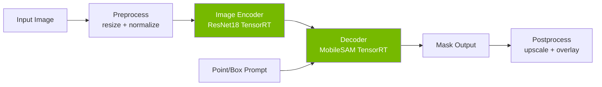
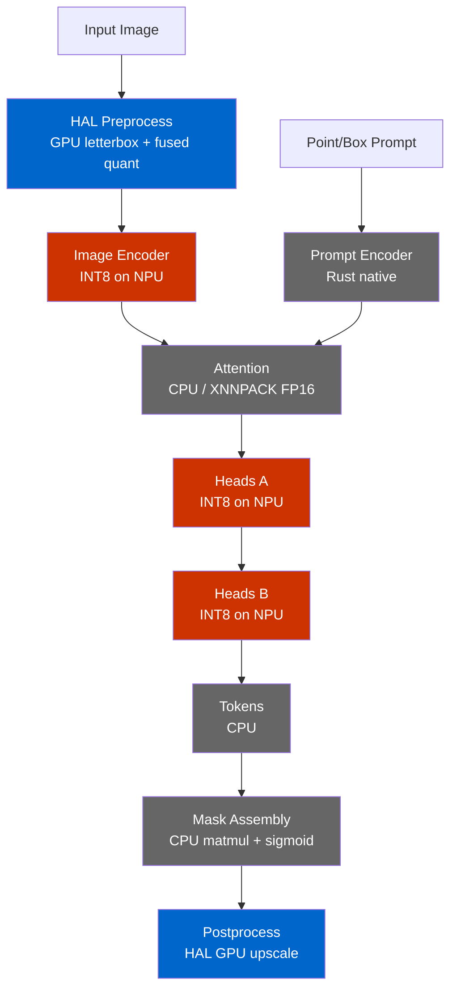
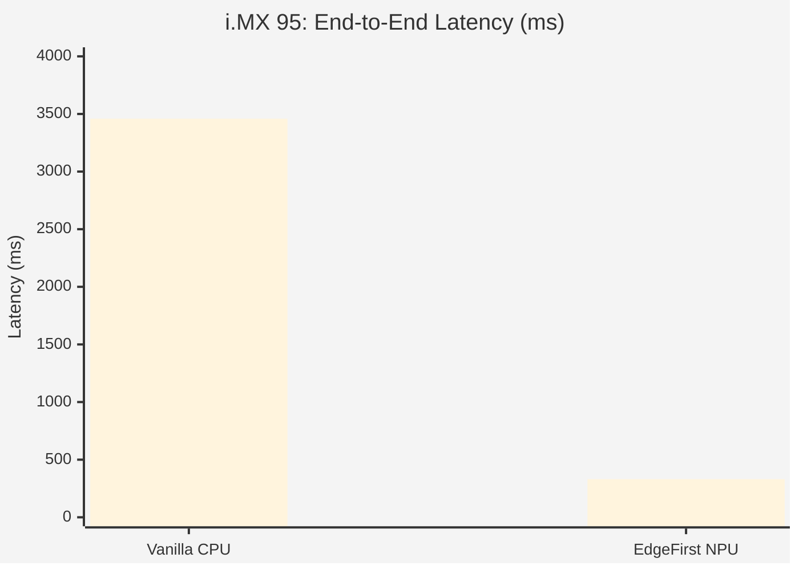

# EdgeFirst NanoSAM: End-to-End Benchmarks

Comprehensive end-to-end benchmarks of EdgeFirst NanoSAM on the Jetson Orin
Nano and NXP i.MX 95, demonstrating how EdgeFirst optimizations solve the
NPU quantization problem and deliver a **10.5x speedup** on i.MX 95.

## Executive Summary

| Platform | Config | Total Latency | Notes |
|----------|--------|--------------|-------|
| Jetson Orin Nano | TensorRT FP16 | 21.6 ms | GPU reference (encoder + decoder) |
| i.MX 95 | Vanilla CPU (ONNX) | 3,459 ms | No NPU — baseline |
| i.MX 95 | Naive NPU (onnx2tf) | BROKEN | Float islands → garbage masks |
| i.MX 95 | **EdgeFirst NPU** | **331 ms** | **10.5x vs CPU, correct masks** |

### Visual Comparison — i.MX 95

| Vanilla CPU (Correct) | Naive onnx2tf → NPU (Broken) | EdgeFirst NPU (Correct) |
|:---:|:---:|:---:|
|  |  |  |

## Methodology

### Test Setup

- **Test image:** `dogs.jpg` (1180x760 RGB)
- **Prompt:** Bounding box [100, 100, 850, 759]
- **Protocol:** 10 warmup runs (discarded) + 100 timed runs
- **Statistics:** mean, median, standard deviation, min, max, p95, p99
- **Timing:** `time.perf_counter()` (Python) / `std::time::Instant` (Rust)
- **Exclusion:** JPEG decode time is excluded from all measurements

### Hardware

| | Jetson Orin Nano | NXP i.MX 95 EVK |
|---|---|---|
| **SoC** | NVIDIA Orin (Ampere GPU) | NXP i.MX 95 |
| **CPU** | 6-core Arm Cortex-A78AE | 6-core Arm Cortex-A55 |
| **Accelerator** | 1024-core Ampere GPU + 2x NVDLA | Neutron NPU |
| **Memory** | 8 GB LPDDR5 | 16 GB LPDDR5 |
| **Power Mode** | MAXN_SUPER + jetson_clocks | performance governor |
| **SW** | JetPack 6.2 (R36 rev 4.4), TensorRT 10.3.0.30, CUDA 12.5 | BSP 6.12-walnascar, kernel 6.12.49-lts-next, Neutron v1.0.0-d98743a7 |

## Pipeline Architecture

### Standard SAM Pipeline



The standard pipeline treats the decoder as a monolithic block. This works
on GPU-equipped platforms like Jetson where TensorRT handles the entire
decoder graph, but prevents NPU deployment on platforms like i.MX 95
where attention layers with dynamic shapes cannot be quantized to INT8.

### EdgeFirst Decomposed Pipeline



**Legend:** Red = NPU (INT8), Blue = GPU (HAL), Grey = CPU

**Why decompose?** The MobileSAM decoder contains both:
- **Static convolutions** (heads) — perfect for INT8 NPU offload
- **Dynamic attention** (cross-attention with variable prompt sizes) — must stay on CPU

Full INT8 quantization of the decoder **fails catastrophically** — the
attention block's softmax and LayerNorm operations amplify quantization
error through three compounding stages: dot-product accumulation (~5.7x
amplification), exponential softmax (65–170% weight shifts from small
quantization deltas), and LayerNorm variance sensitivity. Full INT8
achieves only 48.2% binary mask IoU vs 1.0 for FP32.

By splitting the decoder at the transformer boundary, we keep the
error-sensitive attention in FP16 on CPU (XNNPACK) while offloading the
error-tolerant heads to INT8 on the NPU — a **27x improvement** in max
output error vs full INT8. The prompt encoder is replaced entirely with
a pure Rust implementation (146 vs 1187 ONNX nodes, 55 KB vs 16 MB).

The split architecture delivers a **2.1x decoder speedup** vs the
monolithic ONNX Runtime FP32 decoder (351 ms → 167 ms), with heads
going from 74 ms on CPU to 4.9 ms on NPU — a **15x speedup** for that
stage alone.

### Why Vanilla NanoSAM Fails on NPU

The standard ONNX-to-TFLite conversion (`onnx2tf`) encounters GELU
activation functions that use the `erf` operator. Since `erf` has no
native TFLite INT8 kernel, `onnx2tf` inserts dequantize-to-float32-to-quantize
sequences around every GELU, creating **37 float32 islands**
in what should be a fully quantized graph.

When this TFLite model is compiled with the Neutron SDK (`neutron-converter`),
only 8 of these float operators survive as CPU fallbacks (96.4% conversion
ratio), but those 8 operators are enough to corrupt the embedding and produce
garbage segmentation masks:
1. **Accuracy collapse:** Cosine similarity drops to 0.177 (vs 0.94+ for EdgeFirst)
2. **Split execution:** Neutron creates 2 partitions separated by float ops on CPU
3. **Garbage output:** IoU drops to 0.747, mask coverage 4.8% vs expected ~29%

EdgeFirst solves this with a **twin model** approach: rebuild the encoder
in Keras with tanh-approximate GELU (fully INT8-quantizable), transfer
weights from the trained PyTorch model, and fuse BatchNorm offline.
Result: zero float islands, cosine 0.9398 vs ONNX reference.

## Jetson Orin Nano — GPU Reference

100 runs, 10 warmup. ResNet18 encoder and MobileSAM decoder, both TensorRT
FP16, MAXN_SUPER power mode.

| Stage | Mean (ms) | Median (ms) | Std (ms) | Min (ms) | Max (ms) | P95 (ms) | P99 (ms) |
|-------|-----------|-------------|----------|----------|----------|----------|----------|
| Encoder (TRT FP16) | 15.27 | 15.26 | 0.10 | 15.08 | 15.63 | 15.42 | 15.62 |
| Decoder (TRT FP16) | 6.29 | 6.25 | 0.22 | 6.07 | 8.15 | 6.48 | 6.89 |
| **Total** | **21.56** | **21.52** | **0.26** | **21.15** | **23.53** | **21.87** | **22.08** |

|  |
|:---:|
| NanoSAM segmentation on Jetson Orin Nano (21.6 ms) |

## NXP i.MX 95 — EdgeFirst Optimization

### Vanilla NanoSAM on CPU (baseline)

50 runs, 5 warmup. ONNX Runtime on Cortex-A55 CPU — correct but extremely
slow.

| Stage | Mean (ms) | Median (ms) | Std (ms) | Min (ms) | Max (ms) | P95 (ms) | P99 (ms) |
|-------|-----------|-------------|----------|----------|----------|----------|----------|
| Preprocess (CPU) | 103.47 | 103.41 | 1.79 | 101.25 | 106.91 | 105.60 | 106.45 |
| Encoder (ONNX CPU) | 2953.25 | 2952.12 | 5.23 | 2947.20 | 2979.98 | 2962.60 | 2972.08 |
| Decoder (ONNX CPU) | 402.07 | 402.05 | 2.70 | 396.68 | 409.30 | 406.23 | 408.04 |
| **Total** | **3458.79** | **3458.16** | **5.73** | **3450.30** | **3484.65** | **3467.87** | **3476.66** |

### Naive onnx2tf → Neutron (broken)

**Result: FAILS — garbage segmentation masks**

The naive `onnx2tf` conversion followed by Neutron SDK compilation
(`neutron-converter --target imx95`) produces a model with float32 islands
from GELU/erf decomposition. The converter splits the graph into **2
NeutronGraph partitions** with **8 float operators** remaining on CPU
(96.4% conversion ratio):

```
WARNING: Graph "main" has FLOAT operators which are NOT supported!
```

The model runs (encoder: 198 ms) but the float islands corrupt the
embedding, producing **garbage segmentation masks** (IoU 0.747 vs 0.986
for EdgeFirst, mask coverage 4.8% vs expected ~29%):

| Vanilla CPU (Correct) | Naive onnx2tf → NPU (Broken) | EdgeFirst NPU (Correct) |
|:---:|:---:|:---:|
|  |  |  |

### EdgeFirst NanoSAM (optimized)

100 runs, 10 warmup. Twin model INT8 encoder on Neutron NPU, decomposed
decoder with XNNPACK attention, Rust CLI pipeline. Values are averages
across all runs (per-run distribution not available from the Rust CLI).

IoU: [0.912, 0.986, 0.974, 0.970] — correct output, best mask IoU 0.986.

> **Decoder total** = prompt encoder + attention + heads + tokens + mask
> assembly (146.2 ms). Postprocess (12.8 ms) is measured separately.

| Stage | Mean (avg, ms) |
|-------|----------------|
| Preprocess (resize + pad) | 67.4 |
| Encoder (Neutron INT8) | 104.4 |
| Prompt Encoder (Rust) | 1.3 |
| Attention (XNNPACK FP16) | 103.2 |
| Heads A+B (Neutron INT8) | 5.8 |
| Tokens (CPU) | 0.6 |
| Mask Assembly (matmul) | 35.3 |
| Postprocess (upscale) | 12.8 |
| **Pipeline Total** | **330.7** |

### i.MX 95 Comparison



**10.5x speedup** (3459 ms → 331 ms).

## Cross-Platform Summary

| Platform | Config | Encoder | Decoder | Total |
|----------|--------|---------|---------|-------|
| Jetson Orin Nano | TRT FP16 (GPU ref) | 15.3 ms | 6.3 ms | 21.6 ms |
| i.MX 95 | Vanilla CPU (ONNX) | 2953 ms | 402 ms | 3459 ms |
| i.MX 95 | Naive onnx2tf → NPU | 198 ms | — | BROKEN |
| i.MX 95 | **EdgeFirst NPU** | **104 ms** | **146 ms** | **331 ms** |

## Reproduction

### Jetson Orin Nano

```bash
# Set performance mode
sudo nvpmodel -m 2   # MAXN_SUPER
sudo jetson_clocks

# Build TRT engines
trtexec --onnx=data/resnet18_image_encoder.onnx \
  --saveEngine=data/resnet18_image_encoder.engine --fp16
trtexec --onnx=data/mobile_sam_mask_decoder.onnx \
  --saveEngine=data/mobile_sam_mask_decoder.engine --fp16 \
  --optShapes=point_coords:1x2x2,point_labels:1x2

# Run benchmark
python3 scripts/benchmark_jetson_nvidia.py \
  --image assets/dogs.jpg \
  --encoder data/resnet18_image_encoder.engine \
  --decoder data/mobile_sam_mask_decoder.engine \
  --box 100 100 850 759 --warmup 10 --runs 100
```

### NXP i.MX 95

```bash
# Set performance governor
echo performance | sudo tee /sys/devices/system/cpu/cpufreq/policy*/scaling_governor
```

#### Vanilla CPU

```bash
python3 scripts/benchmark_imx95_vanilla.py cpu \
  --image assets/dogs.jpg \
  --encoder data/resnet18_image_encoder.onnx \
  --decoder data/mobile_sam_mask_decoder.onnx \
  --box 100 100 850 759 --warmup 5 --runs 50
```

#### Naive NPU Attempt

```bash
# Convert with Neutron SDK (produces broken model)
neutron-converter \
  --input encoder_fixed_integer_quant.tflite \
  --output encoder_naive_neutron.tflite \
  --target imx95

python3 scripts/benchmark_imx95_vanilla.py npu \
  --image assets/dogs.jpg \
  --encoder-tflite data/encoder_naive_neutron.tflite \
  --decoder data/mobile_sam_mask_decoder.onnx \
  --box 100 100 850 759
```

#### EdgeFirst Optimized

```bash
./nanosam bench \
  --models nanosam_imx95.zip \
  --image assets/dogs.jpg \
  --box 100 100 850 759 \
  --delegate /usr/lib/libneutron_delegate.so \
  --xnnpack \
  --warmup 10 --runs 100
```
