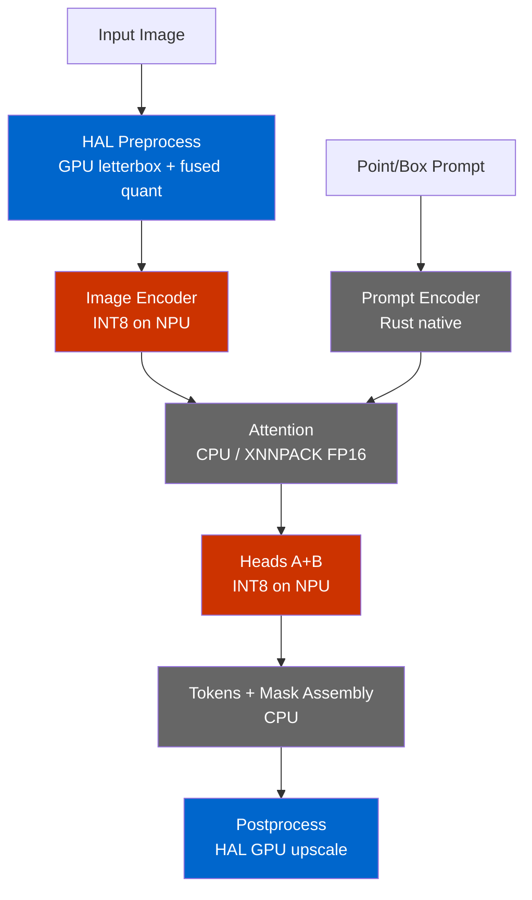

# EdgeFirst NanoSAM: End-to-End Benchmarks

## Summary

### Inference (encoder + decoder)

| Platform | Config | Encoder (ms) | Decoder (ms) | Inference (ms) |
|----------|--------|:------------:|:------------:|:--------------:|
| Jetson Orin Nano | TensorRT FP16 | 15.3 | 6.3 | **21.6** |
| i.MX 95 | Vanilla CPU (ONNX) | 2,953 | 402 | **3,355** |
| i.MX 95 | Naive onnx2tf → NPU | 198 | 366 | **564** |
| i.MX 95 | **EdgeFirst NPU** | **104** | **146** | **250** |

i.MX 95 EdgeFirst vs vanilla CPU: **13.4x** inference speedup.
i.MX 95 EdgeFirst vs naive NPU: **2.3x** faster and produces correct masks.

### End-to-end pipeline (i.MX 95)

| Config | Preprocess | Encoder | Decoder | Postprocess | Total |
|--------|:----------:|:-------:|:-------:|:-----------:|:-----:|
| Vanilla CPU | 103 ms | 2,953 ms | 402 ms | — | **3,459 ms** |
| Naive onnx2tf → NPU | 175 ms | 198 ms | 366 ms | — | **697 ms** |
| **EdgeFirst NPU** | **67 ms** | **104 ms** | **146 ms** | **13 ms** | **331 ms** |

| Vanilla CPU (Correct) | Naive onnx2tf → NPU (Broken) | EdgeFirst NPU (Correct) |
|:---:|:---:|:---:|
|  |  |  |

> **Note:** The INT8 encoder mask has visible quality loss compared to
> the float model — missing coverage on parts of the dog's body.

## Methodology

- **Test image:** `dogs.jpg` (1180x760 RGB)
- **Prompt:** Bounding box [100, 100, 850, 759]
- **Protocol:** 10 warmup + 100 timed runs
- **Timing:** `time.perf_counter()` (Python) / `std::time::Instant` (Rust), excludes JPEG decode

| | Jetson Orin Nano | NXP i.MX 95 EVK |
|---|---|---|
| **CPU** | 6-core Cortex-A78AE | 6-core Cortex-A55 |
| **Accelerator** | Ampere GPU | Neutron NPU |
| **Memory** | 8 GB LPDDR5 | 16 GB LPDDR5 |
| **Power Mode** | MAXN_SUPER + jetson_clocks | performance governor |
| **SW** | JetPack 6.2, TensorRT 10.3, CUDA 12.5 | BSP 6.12-walnascar, Neutron v1.0.0 |

## Decoder Decomposition

The standard SAM decoder is a monolithic block that works on GPU (TensorRT)
but cannot be quantized to INT8 for NPU deployment. Full INT8 quantization
fails — softmax and LayerNorm amplify quantization error, achieving only
48.2% binary mask IoU vs 1.0 for FP32.

EdgeFirst splits the decoder at the transformer boundary:



The encoder uses a **twin model** (Keras rebuild with tanh-approximate GELU,
BN fusion) to eliminate the float islands that break naive onnx2tf conversion.

## Detailed Results

### Jetson Orin Nano — TensorRT FP16

100 runs, 10 warmup, MAXN_SUPER. Encoder and decoder inference only (no
preprocess/postprocess).

| Stage | Mean (ms) | Median (ms) | Std (ms) | Min (ms) | Max (ms) |
|-------|-----------|-------------|----------|----------|----------|
| Encoder | 15.27 | 15.26 | 0.10 | 15.08 | 15.63 |
| Decoder | 6.29 | 6.25 | 0.22 | 6.07 | 8.15 |
| **Total** | **21.56** | **21.52** | **0.26** | **21.15** | **23.53** |

### i.MX 95 — Vanilla CPU (ONNX Runtime)

50 runs, 5 warmup.

| Stage | Mean (ms) |
|-------|-----------|
| Preprocess | 103 |
| Encoder | 2,953 |
| Decoder | 402 |
| **Total** | **3,459** |

### i.MX 95 — Naive onnx2tf → Neutron

Naive conversion produces 37 float32 islands from GELU/erf. After Neutron
SDK compilation, 8 float ops remain on CPU (96.4% conversion ratio). The
model runs but produces garbage masks (coverage 4.8% vs ~29%).

| Stage | Mean (ms) |
|-------|-----------|
| Preprocess | 175 |
| Encoder (Neutron, 2 partitions) | 198 |
| Decoder (ONNX CPU) | 366 |
| **Total** | **697** |

### i.MX 95 — EdgeFirst Optimized (Neutron + XNNPACK)

100 runs, 10 warmup.

| Stage | ms |
|-------|----|
| Preprocess (HAL GPU) | 67.4 |
| Encoder (Neutron INT8) | 104.4 |
| **Decoder total** | **146.2** |
| &nbsp;&nbsp; Prompt Encoder (Rust) | 1.3 |
| &nbsp;&nbsp; Attention (XNNPACK FP16) | 103.2 |
| &nbsp;&nbsp; Heads A+B (Neutron INT8) | 5.8 |
| &nbsp;&nbsp; Tokens (CPU) | 0.6 |
| &nbsp;&nbsp; Mask Assembly (CPU) | 35.3 |
| Postprocess (HAL GPU) | 12.8 |
| **Pipeline Total** | **330.7** |

## Reproduction

### Jetson Orin Nano

```bash
sudo nvpmodel -m 2 && sudo jetson_clocks

trtexec --onnx=data/resnet18_image_encoder.onnx \
  --saveEngine=data/resnet18_image_encoder.engine --fp16
trtexec --onnx=data/mobile_sam_mask_decoder.onnx \
  --saveEngine=data/mobile_sam_mask_decoder.engine --fp16 \
  --optShapes=point_coords:1x2x2,point_labels:1x2

python3 scripts/benchmark_jetson_nvidia.py \
  --image assets/dogs.jpg \
  --encoder data/resnet18_image_encoder.engine \
  --decoder data/mobile_sam_mask_decoder.engine \
  --box 100 100 850 759 --warmup 10 --runs 100
```

### NXP i.MX 95

```bash
echo performance | sudo tee /sys/devices/system/cpu/cpufreq/policy*/scaling_governor

# Vanilla CPU
python3 scripts/benchmark_imx95_vanilla.py cpu \
  --image assets/dogs.jpg \
  --encoder data/resnet18_image_encoder.onnx \
  --decoder data/mobile_sam_mask_decoder.onnx \
  --box 100 100 850 759 --warmup 5 --runs 50

# EdgeFirst optimized
./nanosam bench \
  --models nanosam_imx95.zip \
  --image assets/dogs.jpg \
  --box 100 100 850 759 \
  --delegate /usr/lib/libneutron_delegate.so \
  --xnnpack \
  --warmup 10 --runs 100
```
