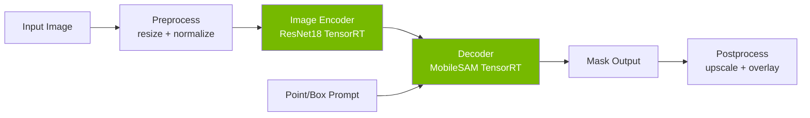
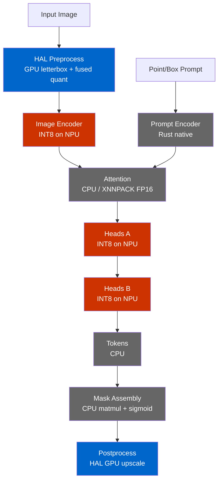
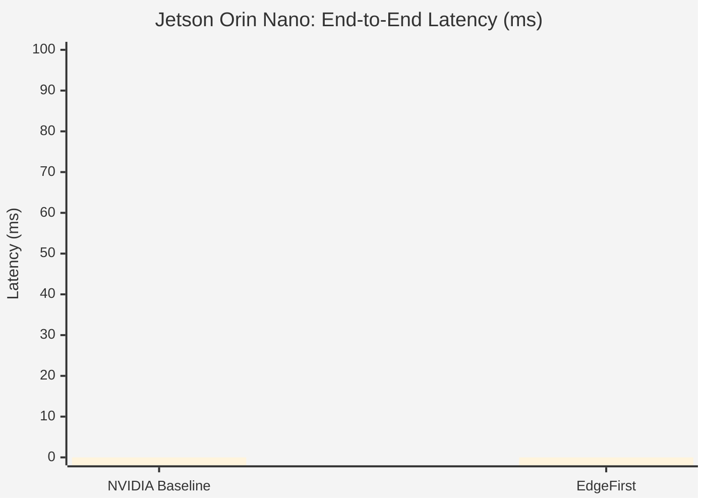
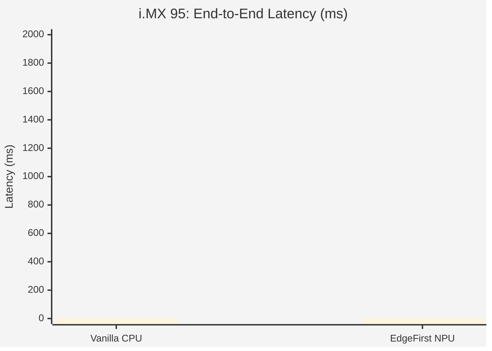

# EdgeFirst NanoSAM: End-to-End Benchmarks

Comprehensive performance comparison of vanilla NVIDIA NanoSAM against
EdgeFirst-optimized NanoSAM on edge platforms.

## Executive Summary

EdgeFirst optimizations deliver significant speedups on both Jetson Orin Nano
and NXP i.MX 95, while solving the fundamental NPU quantization problem that
prevents vanilla NanoSAM from running on integer-only accelerators.

| Platform | Config | Total Latency | Speedup |
|----------|--------|--------------|---------|
| Jetson Orin Nano | NVIDIA Baseline | [J1_TOTAL] ms | 1.0x |
| Jetson Orin Nano | EdgeFirst | [J2_TOTAL] ms | [J_SPEEDUP]x |
| i.MX 95 | Vanilla (CPU) | [M1a_TOTAL] ms | 1.0x |
| i.MX 95 | Vanilla (NPU) | FAILS | — |
| i.MX 95 | EdgeFirst | [M2_TOTAL] ms | [M_SPEEDUP]x |

### Visual Comparison

#### Jetson Orin Nano

| NVIDIA NanoSAM Baseline | EdgeFirst NanoSAM |
|:---:|:---:|
|  |  |

#### NXP i.MX 95

| Naive NPU Conversion (Broken) | EdgeFirst NanoSAM (Correct) |
|:---:|:---:|
|  |  |

## Methodology

### Test Setup

- **Test image:** `dogs.jpg` (886x1330 RGB)
- **Prompt:** Bounding box [100, 100, 850, 759]
- **Protocol:** 10 warmup runs (discarded) + 100 timed runs
- **Statistics:** mean, median, standard deviation, min, max, p95, p99
- **Timing:** `time.perf_counter()` (Python) / `std::time::Instant` (Rust)
- **Exclusion:** JPEG decode time is excluded from all measurements

### Hardware

| | Jetson Orin Nano | NXP i.MX 95 EVK |
|---|---|---|
| **SoC** | NVIDIA Orin (Ampere GPU) | NXP i.MX 95 |
| **CPU** | 6-core Arm Cortex-A78AE | 6-core Arm Cortex-A55 |
| **Accelerator** | 1024-core Ampere GPU + 2x NVDLA | Neutron NPU |
| **Memory** | 8 GB LPDDR5 | 8 GB LPDDR5 |
| **Power Mode** | MAXN + jetson_clocks | performance governor |
| **SW** | [JETPACK_VERSION] | [BSP_VERSION] |

## Pipeline Architecture

### Standard SAM Pipeline (NVIDIA)



The standard pipeline treats the decoder as a monolithic block. This works
on GPU-equipped platforms like Jetson where TensorRT handles the entire
decoder graph, but prevents NPU deployment on platforms like i.MX 95
where attention layers with dynamic shapes cannot be quantized to INT8.

### EdgeFirst Decomposed Pipeline



**Legend:** Red = NPU (INT8), Blue = GPU (HAL), Grey = CPU

**Why decompose?** The MobileSAM decoder contains both:
- **Static convolutions** (heads) — perfect for INT8 NPU offload
- **Dynamic attention** (cross-attention with variable prompt sizes) — must stay on CPU

By splitting the decoder into 5 stages, we can offload the compute-heavy
heads to the NPU while keeping the attention on CPU with XNNPACK FP16
acceleration. The prompt encoder is replaced entirely with a pure Rust
implementation (146 vs 1187 ONNX nodes, 55 KB vs 16 MB).

### Why Vanilla NanoSAM Fails on NPU

The standard ONNX-to-TFLite conversion (`onnx2tf`) encounters GELU
activation functions that use the `erf` operator. Since `erf` has no
native TFLite INT8 kernel, `onnx2tf` inserts dequantize-to-float32-to-quantize
sequences around every GELU, creating **37 float32 islands**
in what should be a fully quantized graph.

These float islands cause:
1. **Accuracy collapse:** Cosine similarity drops to 0.177 (vs 0.94+ for EdgeFirst)
2. **NPU rejection:** Neutron delegate falls back to CPU for float operations
3. **Garbage output:** Segmentation masks are meaningless

EdgeFirst solves this with a **twin model** approach: rebuild the encoder
in Keras with tanh-approximate GELU (fully INT8-quantizable), transfer
weights from the trained PyTorch model, and fuse BatchNorm offline.
Result: zero float islands, cosine 0.9398 vs ONNX reference.

## Jetson Orin Nano Results

### NVIDIA NanoSAM Baseline (J1)

| Stage | Mean (ms) | Median (ms) | Std (ms) | Min (ms) | Max (ms) | P95 (ms) | P99 (ms) |
|-------|-----------|-------------|----------|----------|----------|----------|----------|
| Preprocess + Encoder | [J1_ENC] | | | | | | |
| Decoder | [J1_DEC] | | | | | | |
| **Total** | **[J1_TOTAL]** | | | | | | |

### EdgeFirst NanoSAM (J2)

| Stage | Mean (ms) | Median (ms) | Std (ms) | Min (ms) | Max (ms) | P95 (ms) | P99 (ms) |
|-------|-----------|-------------|----------|----------|----------|----------|----------|
| Preprocess + Encoder | [J2_ENC] | | | | | | |
| Decoder | [J2_DEC] | | | | | | |
| **Total** | **[J2_TOTAL]** | | | | | | |

### Jetson Comparison



*Chart will be populated with actual measurements.*

## NXP i.MX 95 Results

### Vanilla NanoSAM on CPU (M1a)

| Stage | Mean (ms) | Median (ms) | Std (ms) | Min (ms) | Max (ms) | P95 (ms) | P99 (ms) |
|-------|-----------|-------------|----------|----------|----------|----------|----------|
| Preprocess (CPU) | [M1a_PRE] | | | | | | |
| Encoder (ONNX CPU) | [M1a_ENC] | | | | | | |
| Decoder (ONNX CPU) | [M1a_DEC] | | | | | | |
| **Total** | **[M1a_TOTAL]** | | | | | | |

### Naive NPU Conversion (M1b)

**Result: FAILS**

The naive `onnx2tf` conversion of NVIDIA's ResNet18 encoder to TFLite INT8
produces a model with 37 float32 islands due to GELU/erf decomposition.
When run on the Neutron NPU, the output embedding has a cosine similarity
of only **0.177** with the reference — effectively random.

| Vanilla CPU (Correct) | Naive NPU (Broken) |
|:---:|:---:|
|  |  |

### EdgeFirst NanoSAM (M2)

| Stage | Mean (ms) | Median (ms) | Std (ms) | Min (ms) | Max (ms) | P95 (ms) | P99 (ms) |
|-------|-----------|-------------|----------|----------|----------|----------|----------|
| Preprocess (HAL GPU) | [M2_PRE] | | | | | | |
| Encoder (Neutron INT8) | [M2_ENC] | | | | | | |
| Prompt Encoder (Rust) | [M2_PE] | | | | | | |
| Attention (XNNPACK) | [M2_ATT] | | | | | | |
| Heads A+B (Neutron INT8) | [M2_HEADS] | | | | | | |
| Tokens (CPU) | [M2_TOK] | | | | | | |
| Mask Assembly (CPU) | [M2_MASK] | | | | | | |
| Postprocess | [M2_POST] | | | | | | |
| **Total** | **[M2_TOTAL]** | | | | | | |

### i.MX 95 Comparison



*Chart will be populated with actual measurements.*

## Cross-Platform Summary

| Platform | Config | Encoder | Decoder | Preprocess | Total | vs Baseline |
|----------|--------|---------|---------|------------|-------|-------------|
| Jetson Orin Nano | NVIDIA Baseline | [J1_ENC] ms | [J1_DEC] ms | incl. | [J1_TOTAL] ms | 1.0x |
| Jetson Orin Nano | EdgeFirst | [J2_ENC] ms | [J2_DEC] ms | incl. | [J2_TOTAL] ms | [J_SPEEDUP]x |
| i.MX 95 | Vanilla CPU | [M1a_ENC] ms | [M1a_DEC] ms | [M1a_PRE] ms | [M1a_TOTAL] ms | 1.0x |
| i.MX 95 | EdgeFirst NPU | [M2_ENC] ms | [M2_DEC_TOTAL] ms | [M2_PRE] ms | [M2_TOTAL] ms | [M_SPEEDUP]x |

## Reproduction

### Jetson Orin Nano

#### Prerequisites

```bash
# Set performance mode
sudo nvpmodel -m 0
sudo jetson_clocks
```

#### NVIDIA Baseline (J1)

```bash
cd ~/models/nanosam-nvidia
# Download models (see NVIDIA README for Google Drive links)
trtexec --onnx=data/resnet18_image_encoder.onnx \
  --saveEngine=data/resnet18_image_encoder.engine --fp16
trtexec --onnx=data/mobile_sam_mask_decoder.onnx \
  --saveEngine=data/mobile_sam_mask_decoder.engine \
  --minShapes=point_coords:1x1x2,point_labels:1x1 \
  --maxShapes=point_coords:1x10x2,point_labels:1x10

cd ~/models/nanosam
python3 scripts/benchmark_jetson_nvidia.py \
  --image assets/dogs.jpg \
  --encoder ../nanosam-nvidia/data/resnet18_image_encoder.engine \
  --decoder ../nanosam-nvidia/data/mobile_sam_mask_decoder.engine \
  --box 100 100 850 759 --warmup 10 --runs 100
```

#### EdgeFirst (J2)

```bash
cd ~/models/nanosam
python3 scripts/benchmark_jetson_edgefirst.py \
  --image assets/dogs.jpg \
  --encoder data/resnet18_e200.engine \
  --decoder data/mobile_sam_mask_decoder.engine \
  --box 100 100 850 759 --warmup 10 --runs 100
```

### NXP i.MX 95

#### Prerequisites

```bash
# Set performance governor
echo performance | sudo tee /sys/devices/system/cpu/cpufreq/policy*/scaling_governor
```

#### Vanilla CPU (M1a)

```bash
cd ~/models/nanosam
python3 scripts/benchmark_imx95_vanilla.py cpu \
  --image assets/dogs.jpg \
  --encoder data/resnet18_image_encoder.onnx \
  --decoder data/mobile_sam_mask_decoder.onnx \
  --box 100 100 850 759 --warmup 5 --runs 50
```

#### Naive NPU Attempt (M1b)

```bash
python3 scripts/benchmark_imx95_vanilla.py npu \
  --image assets/dogs.jpg \
  --encoder data/encoder_onnx2tf_int8.tflite \
  --decoder data/mobile_sam_mask_decoder.onnx \
  --box 100 100 850 759
```

#### EdgeFirst (M2)

```bash
./nanosam bench \
  --models nanosam_imx95.zip \
  --image assets/dogs.jpg \
  --box 100 100 850 759 \
  --delegate /usr/lib/libNeutronDelegate.so \
  --warmup 10 --runs 100
```
